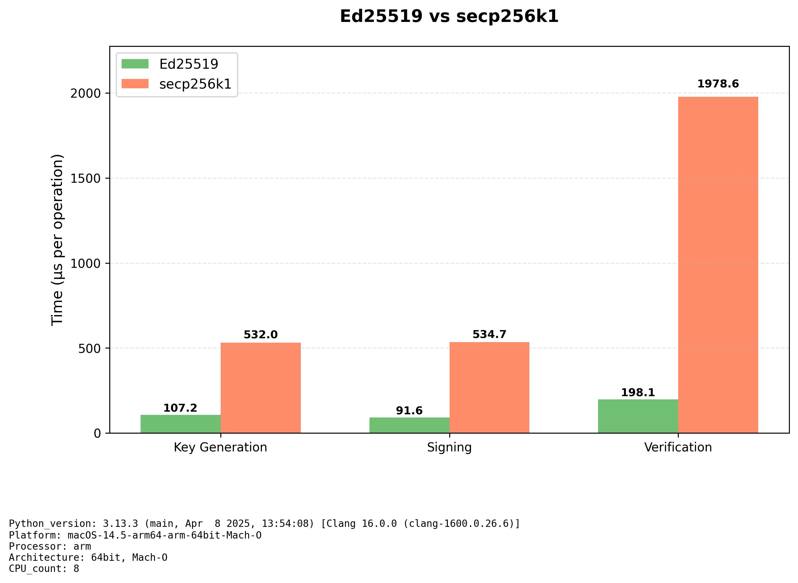

# secp256k1 vs ed25519 Benchmark

This repository presents a performance benchmark of two elliptic-curve cryptographic algorithms: secp256k1 and ed25519. The comparison focuses on three core cryptographic operations:
Key generation
Digital signing
Signature verification

Both algorithms are widely adopted in real-world systems — secp256k1 forms the backbone of Bitcoin, Ethereum, and other blockchain platforms, while ed25519 is the preferred choice in modern security protocols such as SSH and TLS, as well as blockchain networks like Polkadot and Solana.

This work is motivated by the limited availability of direct, reproducible benchmarks contrasting these two algorithms. By providing consistent measurement results, the project aims to support data-driven decision-making for cryptographic implementations




It has two Python programs:

- **benchmark.py**  
  Runs performance tests on both algorithms and generates two CSV files:  
  - `benchmark_results.csv` → benchmark results (operation and execution time)  
  - `env_info.csv` → execution environment details (OS, CPU, Python version)

- **illustrate.py**  
  Reads the CSV files and generates bar charts comparing the algorithms for **Key Generation**, **Signing**, and **Verification**.

---

## Requirements

- Python **3.13+**
- Install dependencies with:

```
pip3 install cryptography ecdsa matplotlib pandas
```

## Usage
1. Run Benchmark
```
python3 benchmark.py
```
This will produce `benchmark_results.csv` and `env_info.csv`.

2. Generate Graph
```
python3 illustrate.py
```
This will produce `benchmark_comparison.png`